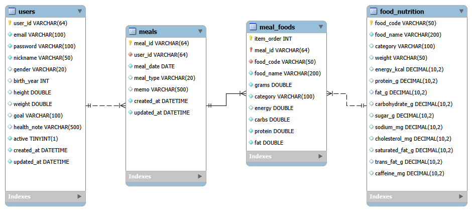
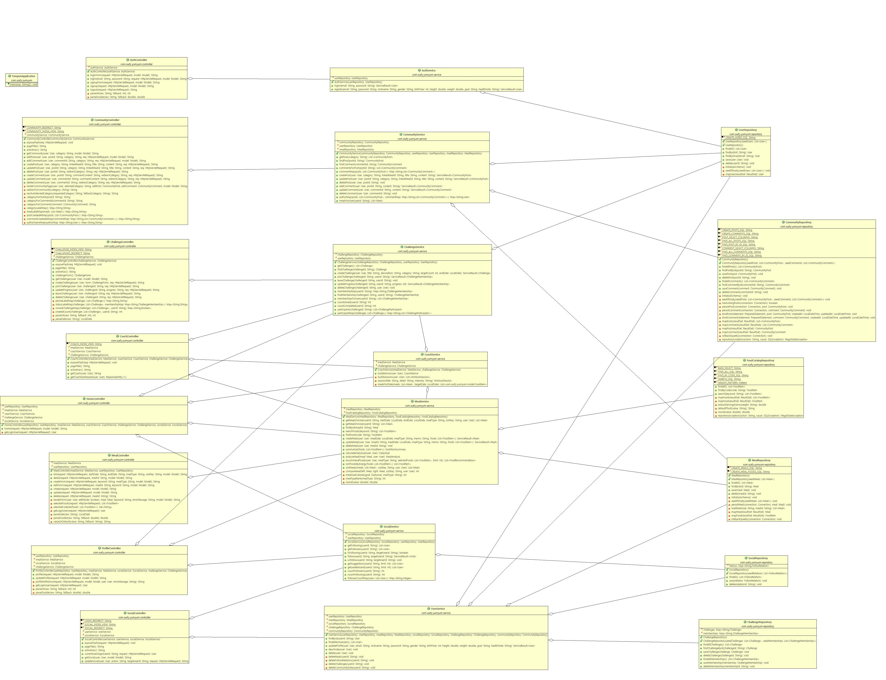
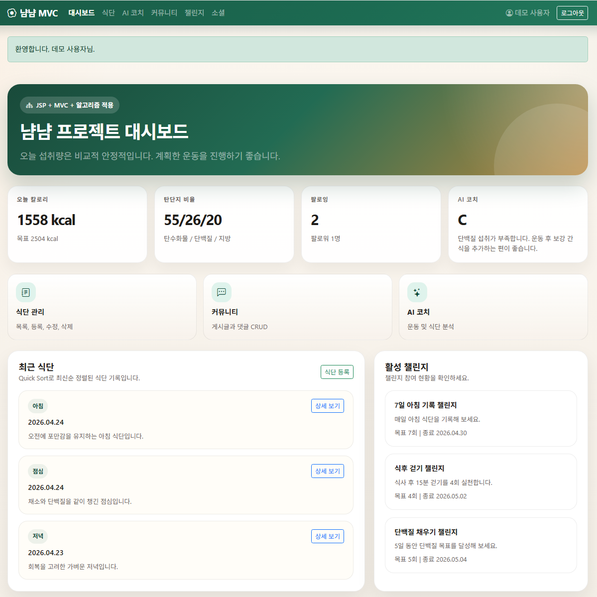
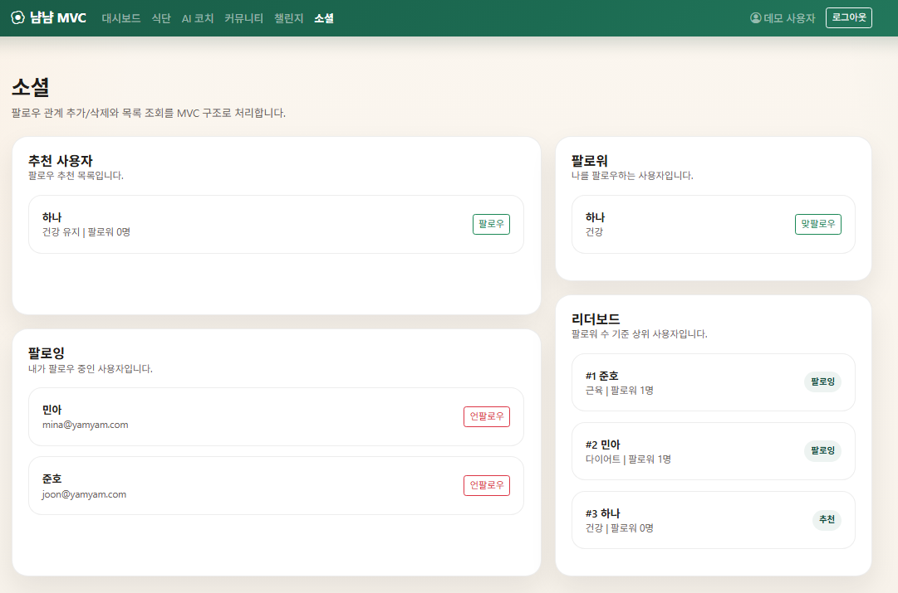
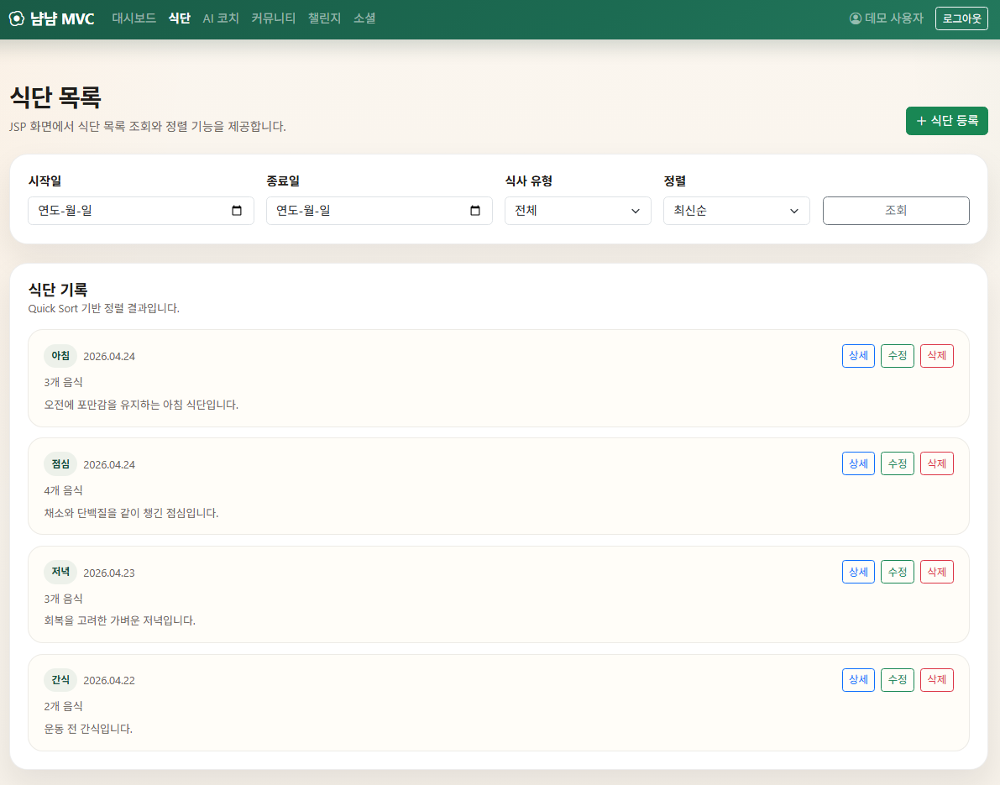
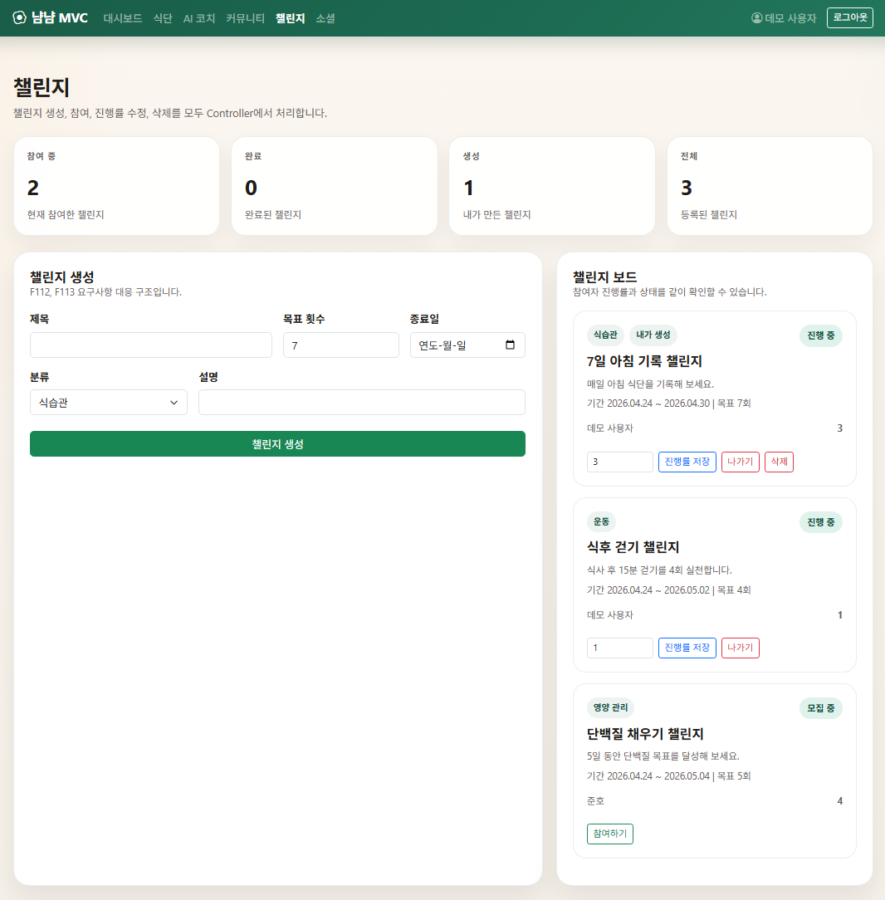
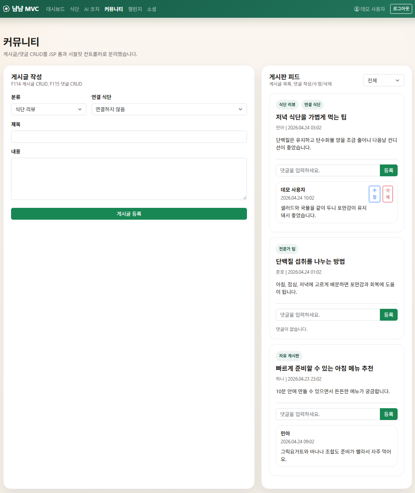

# YumYumCoach Spring PJT

- 1541268 윤다인
- 1544345 김동주

## 프로젝트 개요

기존 Servlet/JSP 기반 YumYumCoach 프로젝트를 Spring Boot 기반 구조로 전환했습니다.

회원 인증, 프로필 관리, 식단 관리, 커뮤니티, 챌린지, AI 코치, 소셜 기능을 Spring MVC 방식으로 정리했고, MySQL DB와 연동해 회원과 식단 데이터를 저장하도록 구성했습니다.

---

## 실행 환경

- Java 21
- Spring Boot 3.4.5
- Maven
- MySQL
- JSP
- JDBC
- MySQL Workbench

---

## AS-IS

- Servlet의 `doGet`, `doPost` 중심으로 요청을 처리했습니다.
- `BaseController`, `AppContainer` 중심의 수동 객체 관리 방식이 많았습니다.
- 일부 기능은 메모리 또는 직접 생성된 Repository 객체에 의존했습니다.
- 로그인 여부 확인 로직이 각 Controller에 흩어져 있었습니다.
- 오류 발생 시 공통 예외 처리 흐름이 부족했습니다.

---

## TO-BE

- Spring Boot 프로젝트로 전환했습니다.
- `@Controller`, `@Service`, `@Repository`를 적용해 Spring Bean 기반으로 관리했습니다.
- `application.properties`에서 DB 연결 정보와 JSP View Resolver를 설정했습니다.
- 로그인 확인은 `LoginCheckFilter`에서 공통 처리하도록 구성했습니다.
- `CustomException`, `GlobalExceptionHandler`를 통해 공통 예외 화면을 제공했습니다.
- 회원, 프로필, 식단 기능은 Spring MVC 방식으로 전환했습니다.
- 식단 데이터는 `meals`, `meal_foods`, `food_nutrition` 테이블과 연동했습니다.

---

## 주요 기능

| 구분 | 기능 |
|---|---|
| 인증 | 회원가입, 로그인, 로그아웃 |
| 필터 | 로그인 필요 페이지 접근 제한 |
| 프로필 | 회원 정보 조회, 수정, 계정 비활성화 |
| 식단 | 식단 목록 조회, 등록, 상세 조회, 수정, 삭제 |
| 음식 데이터 | 음식 검색, 음식 선택, 섭취량 기반 영양 계산 |
| AI 코치 | 식단 요약 및 코치 대시보드 |
| 커뮤니티 | 게시글 CRUD, 댓글 CRUD |
| 챌린지 | 챌린지 생성, 참여, 진행률 수정, 탈퇴, 삭제 |
| 소셜 | 팔로우, 언팔로우, 추천 사용자, 리더보드 |
| 예외 처리 | 커스텀 예외 및 공통 오류 화면 |

---

## 프로젝트 구조

```text
src/main/java/com/ssafy/yumyum
├── controller
│   ├── AuthController.java
│   ├── HomeController.java
│   ├── ProfileController.java
│   ├── MealController.java
│   ├── CommunityController.java
│   ├── ChallengeController.java
│   ├── CoachController.java
│   └── SocialController.java
│
├── service
│   ├── AuthService.java
│   ├── UserService.java
│   ├── MealService.java
│   ├── CommunityService.java
│   ├── ChallengeService.java
│   ├── CoachService.java
│   └── SocialService.java
│
├── repository
│   ├── UserRepository.java
│   ├── MealRepository.java
│   ├── FoodCatalogRepository.java
│   ├── CommunityRepository.java
│   ├── ChallengeRepository.java
│   └── SocialRepository.java
│
├── filter
│   └── LoginCheckFilter.java
│
├── exception
│   ├── CustomException.java
│   └── GlobalExceptionHandler.java
│
└── util
````

---

## DB 설계

이번 Spring 프로젝트에서는 실제 코드 기준에 맞춰 아래 테이블을 사용했습니다.

| 테이블              | 설명            |
| ---------------- | ------------- |
| `users`          | 회원 정보         |
| `meals`          | 사용자별 식단 기록    |
| `meal_foods`     | 식단에 포함된 음식 상세 |
| `food_nutrition` | 음식 영양 정보      |

### 주요 관계

| 관계                                  | 설명                          |
| ----------------------------------- | --------------------------- |
| `users` 1 : N `meals`               | 한 사용자는 여러 식단을 등록할 수 있습니다.   |
| `meals` 1 : N `meal_foods`          | 한 식단은 여러 음식을 포함할 수 있습니다.    |
| `food_nutrition` 1 : N `meal_foods` | 음식 영양정보를 기준으로 식단 음식을 선택합니다. |

---

## ERD



---

## 클래스 다이어그램



---

## 실행 화면

### 메인 화면



### 소셜 화면



### 식단 기록 화면



### 챌린지 화면



### 커뮤니티 화면



---

## 테스트 계정

```text
이메일: demo@yumyum.com
비밀번호: Demo1234!
```

---

## 실행 방법

1. MySQL에서 `ssafy_yumyumcoach` 스키마를 생성합니다.
2. `SSAFY_COACH_Schema.sql`을 실행합니다.
3. 필요한 음식 데이터는 `food_nutrition` 테이블에 추가합니다.
4. `application.properties`의 DB 계정 정보를 확인합니다.
5. `YumyumApplication.java`를 실행합니다.
6. 브라우저에서 아래 주소로 접속합니다.

```text
http://localhost:8080
```

---

## application.properties 주요 설정

```properties
spring.application.name=springyum

server.port=8080

spring.datasource.url=jdbc:mysql://localhost:3306/ssafy_yumyumcoach?serverTimezone=Asia/Seoul&characterEncoding=UTF-8
spring.datasource.username=ssafy
spring.datasource.password=ssafy
spring.datasource.driver-class-name=com.mysql.cj.jdbc.Driver

spring.mvc.view.prefix=/WEB-INF/views/
spring.mvc.view.suffix=.jsp

server.servlet.encoding.charset=UTF-8
server.servlet.encoding.enabled=true
server.servlet.encoding.force=true
```

---

## 제출 파일

```text
YumYumCoach_spring_서울_8반_김동주_윤다인.zip
```

제출 전 아래 폴더는 삭제합니다.

```text
.git
bin
target
```

---

## 구현 정리

이번 프로젝트에서는 기존 Servlet/JSP 프로젝트를 Spring Boot 기반으로 전환하면서 요청 처리 구조를 정리했습니다.

Controller는 요청과 화면 이동을 담당하고, Service는 검증과 비즈니스 로직을 담당하며, Repository는 DB 접근을 담당하도록 역할을 나누었습니다.

또한 로그인 필터와 공통 예외 처리를 추가해 중복 코드를 줄이고, 사용자 인증이 필요한 페이지를 일관되게 제어할 수 있도록 구성했습니다.

