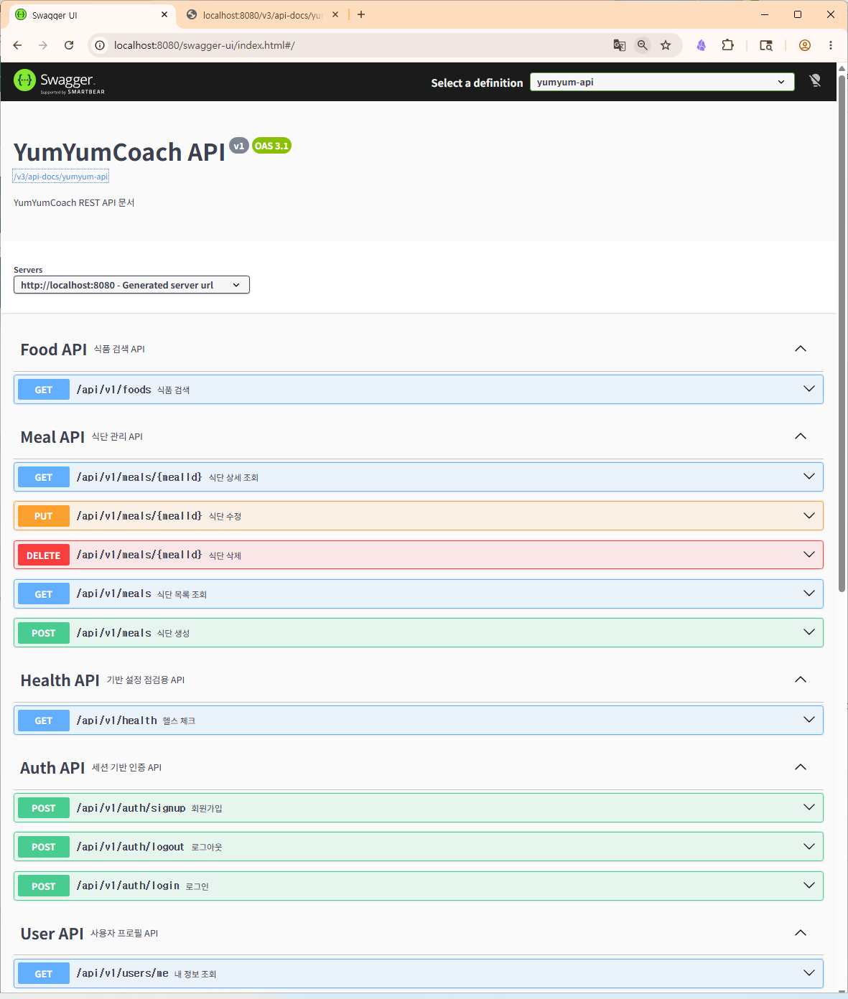
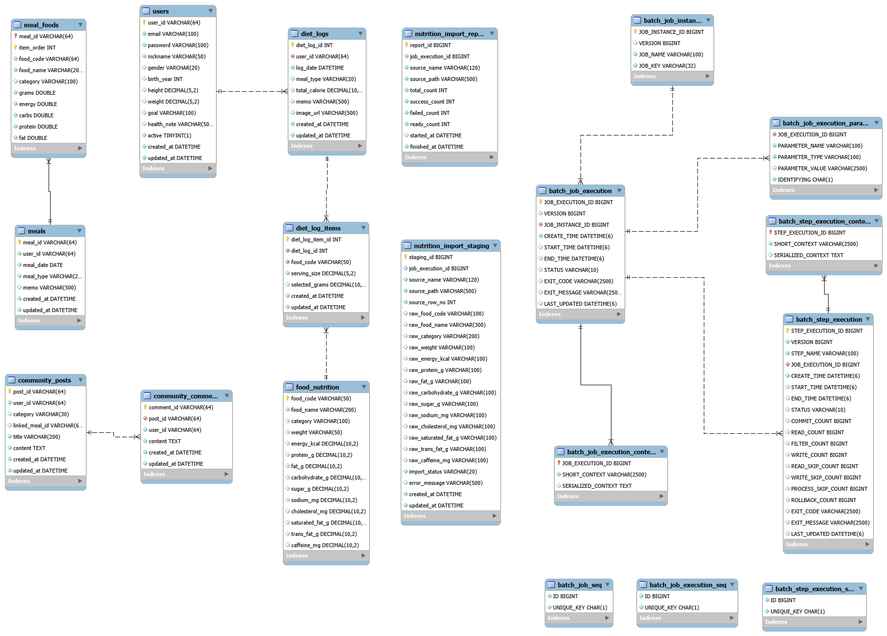

# YumYumCoach Spring PJT

- 1541268 윤다인
- 1544345 김동주

## 프로젝트 이력

- `springyum`: Servlet/JSP 기반 프로젝트를 Spring Boot + Spring MVC/JSP 구조로 1차 전환한 시점
- `master`: 분석 문서 작성 후 REST API 확장 1차 구현을 반영한 시점

## `springyum` 이후 `master` 변경점

- 기반: Spring Security, BCrypt `PasswordEncoder`, AOP 로깅, Swagger(OpenAPI), API 예외 처리 추가
- API: `/api/v1/auth`, `/api/v1/users/me`, `/api/v1/meals`, `/api/v1/foods`, `/api/v1/health` 추가
- 보안: 회원가입/비밀번호 변경 암호화, 레거시 평문 비밀번호 점진 마이그레이션 적용
- 품질: `WebMvcTest`, `assets/openapi.json`, `docs/RESTAPI-PLAN.md` 추가
- 다음 단계: 챌린지·소셜 영속화, 추가 REST API 공개

## API 문서

- OpenAPI Spec: [openapi.json](./assets/openapi.json)
- Swagger UI: http://localhost:8080/swagger-ui/index.html
- Swagger UI 캡처:



## 프로젝트 개요

기존 Servlet/JSP 기반 YumYumCoach 프로젝트를 Spring Boot 기반 구조로 전환했습니다.

회원 인증, 프로필 관리, 식단 관리, 커뮤니티, 챌린지, AI 코치, 소셜 기능의 요청 흐름을 Spring MVC 방식으로 정리했고, MySQL DB와 연동해 회원과 식단 데이터를 저장하도록 구성했습니다.

## 실행 환경

- Java 21
- Spring Boot 3.4.5
- Maven
- MySQL
- JSP
- JDBC

## AS-IS

- Servlet의 `doGet`, `doPost`와 액션 파라미터 중심으로 요청을 처리했습니다.
- `BaseController`, `AppContainer` 중심의 수동 객체 관리 방식이 많았습니다.
- 로그인 확인과 세션 검증 로직이 여러 Controller에 중복되어 있었습니다.
- JSP에 스크립틀릿과 직접 URL 조합이 많아 화면 유지보수가 번거로웠습니다.
- 예외 상황을 공통으로 처리하는 흐름과 에러 화면 구성이 부족했습니다.

## TO-BE

- Spring Boot 프로젝트로 전환하고 `@Controller`, `@Service`, `@Repository` 기반으로 구성했습니다.
- 주요 화면과 기능을 Spring MVC 컨트롤러 및 RESTful 경로 중심으로 재구성했습니다.
- `application.properties`에서 DB 연결 정보와 JSP View Resolver를 설정했습니다.
- `LoginCheckFilter`, `SessionUtils`로 인증, 세션, 플래시 메시지 처리를 공통화했습니다.
- `CustomException`, `GlobalExceptionHandler`, 에러 페이지를 추가해 예외 응답 흐름을 정리했습니다.
- 식단 데이터는 `users`, `meals`, `meal_foods`, `food_nutrition` 테이블과 연동하도록 구성했습니다.

## 주요 기능

| 구분        | 기능                                        |
| ----------- | ------------------------------------------- |
| 인증        | 회원가입, 로그인, 로그아웃                  |
| 필터        | 로그인 필요 페이지 접근 제한                |
| 프로필      | 회원 정보 조회, 수정, 계정 비활성화         |
| 식단        | 식단 목록 조회, 등록, 상세 조회, 수정, 삭제 |
| 음식 데이터 | 음식 검색, 음식 선택, 섭취량 기반 영양 계산 |
| AI 코치     | 식단 요약 및 코치 대시보드                  |
| 커뮤니티    | 게시글 CRUD, 댓글 CRUD                      |
| 챌린지      | 챌린지 생성, 참여, 진행률 수정, 탈퇴, 삭제  |
| 소셜        | 팔로우, 언팔로우, 추천 사용자, 리더보드     |
| 예외 처리   | 커스텀 예외 및 공통 오류 화면               |

## 프로젝트 구조

```text
src/main/java/com/ssafy/yumyum
├── controller
│   ├── AuthController.java
│   ├── HomeController.java
│   ├── ProfileController.java
│   ├── MealController.java
│   ├── CommunityController.java
│   ├── ChallengeController.java
│   ├── CoachController.java
│   └── SocialController.java
│
├── service
│   ├── AuthService.java
│   ├── UserService.java
│   ├── MealService.java
│   ├── CommunityService.java
│   ├── ChallengeService.java
│   ├── CoachService.java
│   └── SocialService.java
│
├── repository
│   ├── UserRepository.java
│   ├── MealRepository.java
│   ├── FoodCatalogRepository.java
│   ├── CommunityRepository.java
│   ├── ChallengeRepository.java
│   └── SocialRepository.java
│
├── filter
│   └── LoginCheckFilter.java
│
├── exception
│   ├── CustomException.java
│   └── GlobalExceptionHandler.java
│
└── util
```

## DB 설계

이번 Spring 프로젝트에서는 실제 코드 기준에 맞춰 아래 테이블을 사용했습니다.

| 테이블           | 설명                    |
| ---------------- | ----------------------- |
| `users`          | 회원 정보               |
| `meals`          | 사용자별 식단 기록      |
| `meal_foods`     | 식단에 포함된 음식 상세 |
| `food_nutrition` | 음식 영양 정보          |

### 주요 관계

| 관계                                | 설명                                             |
| ----------------------------------- | ------------------------------------------------ |
| `users` 1 : N `meals`               | 한 사용자는 여러 식단을 등록할 수 있습니다.      |
| `meals` 1 : N `meal_foods`          | 한 식단은 여러 음식을 포함할 수 있습니다.        |
| `food_nutrition` 1 : N `meal_foods` | 음식 영양정보를 기준으로 식단 음식을 선택합니다. |

## 다이어그램

### ERD



### 클래스 다이어그램


## 실행 화면

### 메인 화면 / 소셜 화면

<p align="center">
  
  
</p>

### 식단 기록 / 커뮤니티 화면

<p align="center">
  
  
</p>

### 챌린지 화면

<p align="center">
  
</p>

## 테스트 계정

```text
이메일: demo@yumyum.com
비밀번호: Demo1234!
```

## 실행 방법

1. MySQL에서 `ssafy_yumyumcoach` 스키마를 생성합니다.
2. `src/main/resources/SSAFY_COACH_Schema.sql`을 실행합니다.
3. 필요하면 `src/main/resources/SSAFY_COACH_Demo_Dump.sql`로 예시 데이터를 추가합니다.
4. `src/main/resources/application.properties`의 DB 계정 정보를 확인합니다.
5. `YumyumApplication.java`를 실행합니다.
6. 브라우저에서 `http://localhost:8080`으로 접속합니다.

## application.properties 주요 설정

```properties
spring.application.name=springyum

server.port=8080

spring.datasource.url=jdbc:mysql://localhost:3306/ssafy_yumyumcoach?serverTimezone=Asia/Seoul&characterEncoding=UTF-8
spring.datasource.username=ssafy
spring.datasource.password=ssafy
spring.datasource.driver-class-name=com.mysql.cj.jdbc.Driver

spring.mvc.view.prefix=/WEB-INF/views/
spring.mvc.view.suffix=.jsp

server.servlet.encoding.charset=UTF-8
server.servlet.encoding.enabled=true
server.servlet.encoding.force=true
```

## 관련 파일

- [openapi.json](./assets/openapi.json)
- [ssafy_yumyumcoach.mwb](./assets/ssafy_yumyumcoach.mwb)
- [ssafy_yumyumcoach.png](./assets/ssafy_yumyumcoach.png)
- [ssafy_yumyumcoach.sql](./assets/ssafy_yumyumcoach.sql)

## 제출 파일

```text
YumYumCoach_spring_서울_8반_김동주_윤다인.zip
```

제출 전 아래 폴더는 삭제합니다.

```text
.git
bin
target
```
