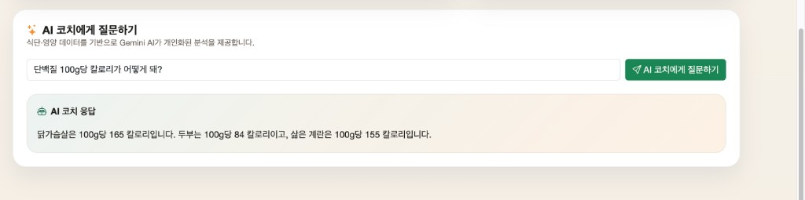
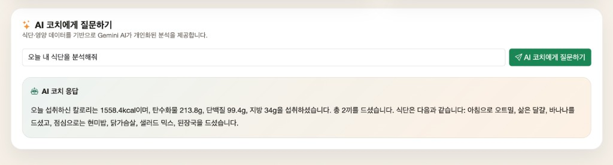
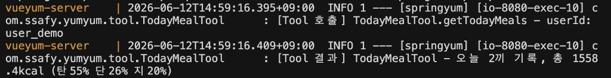

# YumYumCoach VueYum + Spring AI

- `1541268` 윤다인 (팀장)
- `1544345` 김동주

## 요약

YumYumCoach 프로젝트의 기존 JSP 사용자 화면을 **Vue 3 + Vite SPA**로 전환한 버전에, **Spring AI + Google Gemini 기반 AI 영양 코치** 기능을 추가한 버전입니다.

- 커뮤니티 기능이 관통 PJT 게시판 구현 요구사항에 대응합니다.
- 기존 JSP로 구현된 프론트를 Vue.js로 포팅하였습니다.
- **이번 주차 관통 프로젝트**: Spring AI를 적용하여 단일 Tool 호출, 다중 Tool 호출, Tool 결과 기반 AI 응답 생성 필수 요구사항을 모두 구현하였습니다.
- Docker Compose를 구성해두었으니, compose를 실행하면 서비스가 바로 실행됩니다.
  - MySQL 워크벤치 없이 mysql 이미지로 데이터베이스 서버를 구성하오니, 포트 충돌에 주의해야합니다.
  - Dockerfile을 이용한 Spring Boot 어플리케이션 이미지 구성 전, Multi-stage build로 Vue.js 프로젝트를 빌드하여 Spring Boot App의 static 폴더에 배치하여 런타임에 SPA를 서빙하는 형태입니다.
  - `GMS_API_KEY` 환경변수를 설정한 뒤 실행해야 AI 기능이 정상 동작합니다.

```sh
export GMS_API_KEY=your_gms_api_key
docker compose up
```

## 프로젝트 개요

YumYumCoach는 사용자의 식단 기록과 음식 영양 정보를 관리하는 Spring Boot 기반 애플리케이션입니다.

이번 변경의 핵심은 **Spring AI 1.1.6**과 **Google Gemini(GMS 프록시)**를 연동하여 AI 영양 코치 기능을 추가한 것입니다. 기존 `FoodCatalogRepository`, `UserRepository`, `MealService`를 Spring AI Tool로 감싸 LLM이 실제 DB 데이터를 기반으로 응답을 생성합니다. Vue 코치 페이지에 AI 채팅 인터페이스를 추가하여 사용자가 자연어로 식단 분석을 요청할 수 있습니다.

일반 사용자 화면은 `client` 디렉터리의 Vue 3 + Vite SPA가 담당합니다. Spring Boot는 `pnpm build`로 생성된 `src/main/resources/static/index.html`을 `/`, `/home`, `/auth/*`, `/meals*`, `/profile`, `/coach`, `/community`, `/challenges`, `/social` 경로에 forward합니다. 기존 JSP 화면 컨트롤러와 JSP 파일은 레거시 확인용으로 `/legacy/**` 경로에 남아 있습니다.

Spring Batch 기반 영양성분 데이터 적재 기능은 유지됩니다. 외부 영양성분 원천 데이터 파일을 읽어 staging 테이블에 저장한 뒤 정제와 검증을 거쳐 `food_nutrition` 테이블에 upsert합니다.

> [!NOTE]
> 외부 영양성분 데이터 출처: [식품의약품안전처 식품영양성분데이터베이스](https://various.foodsafetykorea.go.kr/nutrient/)

## 주요 변경점

- **Spring AI 연동 (이번 관통 프로젝트)**
  - `spring-ai-bom 1.1.6`과 `spring-ai-starter-model-google-genai`를 의존성에 추가했습니다.
  - SSAFY GMS 프록시를 통해 `gemini-2.5-flash-lite` 모델을 사용합니다.
  - Spring AI 1.1.6에서 `base-url` 프로퍼티가 자동 구성에 적용되지 않는 문제를 `AiConfig`에서 `Client`를 직접 생성해 해결했습니다.
  - `ChatClient`에 한국어 자연어 응답을 유도하는 System Prompt를 설정했습니다.

- **Spring AI Tool 구현**
  - `FoodSearchTool`: 기존 `FoodCatalogRepository.search()`를 재사용해 음식 이름 키워드로 영양성분을 검색합니다. 단일 Tool 호출 요구사항을 충족합니다.
  - `UserProfileTool`: 기존 `UserRepository.findById()`를 재사용해 사용자 프로필(닉네임, 목표, 신장, 체중 등)을 조회합니다.
  - `TodayMealTool`: 기존 `MealService`를 재사용해 오늘 식단 목록과 총 영양 섭취량을 조회합니다.
  - `DailyGoalTool`: 기존 `MealService.calculateDailyGoal()`을 재사용해 BMR 기반 하루 권장 영양 목표를 계산합니다.
  - `UserProfileTool` → `TodayMealTool` → `DailyGoalTool` 3개 Tool 연쇄 호출로 다중 Tool 호출 요구사항을 충족합니다.
  - 각 Tool에 호출 및 결과 로그를 추가해 실행 흐름을 서버 로그에서 확인할 수 있습니다.

- **AI API 엔드포인트 추가**
  - `GET /api/v1/ai/food`: `FoodSearchTool` 단일 호출로 음식 영양성분을 검색하고 AI 응답을 반환합니다.
  - `GET /api/v1/ai/coach`: 4개 Tool을 모두 등록해 사용자 식단 종합 분석 응답을 반환합니다.
  - 두 엔드포인트 모두 Swagger UI에서 바로 테스트할 수 있습니다.

- **Vue AI 채팅 인터페이스 추가**
  - 코치 페이지(`/coach`)에 AI 질문 입력창과 응답 표시 영역을 추가했습니다.
  - 질문 전송 중 로딩 스피너와 버튼 비활성화 처리로 UX를 개선했습니다.
  - 기존 코치 대시보드 레이아웃은 그대로 유지하고 하단에 AI 채팅 섹션만 추가했습니다.

- **Vue SPA 전환 (이전 관통 프로젝트)**
  - `client` 디렉터리에 Vue 3 + Vite + TypeScript 프로젝트를 추가했습니다.
  - `client/src/views`의 Vue 화면이 기존 JSP 사용자 화면을 대체합니다.
  - 공통 레이아웃, Router, Pinia 세션 store, alert 상태를 Vue 기준으로 구성했습니다.
  - `client/src/composables`의 Axios API composable이 `/api/v1/**` REST API를 호출합니다.
  - 세션 기반 인증은 유지하며, JWT/token refresh/interceptor 기반 인증은 사용하지 않습니다.

- **REST API 보강**
  - 홈/코치 대시보드 API를 Vue 화면에서 사용할 수 있는 JSON API로 추가했습니다.
  - 커뮤니티 게시글/댓글 CRUD API를 추가했습니다.
  - 챌린지 생성/참여/진행률 수정/탈퇴/삭제 API를 추가했습니다.
  - 소셜 팔로우/언팔로우, 추천 사용자, 팔로워/팔로잉, 리더보드 API를 추가했습니다.

- **개발/실행 환경 정리**
  - Vite 개발 서버가 `/api`, `/batch`, `/swagger-ui`, `/v3/api-docs` 요청을 Spring Boot로 proxy합니다.
  - `client/Dockerfile`로 Vue 개발 서버 실행 환경을 분리했습니다.
  - `database/Dockerfile`로 MySQL 초기 스키마와 demo data 적재 환경을 구성했습니다.

```text
email: demo@yumyum.com
password: Demo1234!
```

## AS-IS

- AI 기능 없이 사용자가 직접 데이터를 입력하고 수치를 확인하는 방식이었습니다.
- 코치 페이지는 정적인 대시보드로, 영양 조언은 제공되지 않았습니다.
- 식단·영양성분 데이터는 DB에 있었지만 LLM이 이를 해석하거나 활용하는 기능이 없었습니다.
- 일반 사용자 화면이 JSP와 Spring MVC view controller에 묶여 있었습니다.
- SPA route 직접 접근과 새로고침을 처리하는 Spring fallback 구성이 없었습니다.

## TO-BE

- `FoodSearchTool`, `UserProfileTool`, `TodayMealTool`, `DailyGoalTool`이 기존 DB 데이터를 LLM에 제공합니다.
- Gemini가 Tool 실행 결과만을 근거로 개인화된 한국어 영양 조언을 생성합니다.
- 코치 페이지에서 자연어 질문으로 식단 분석과 음식 영양 검색을 모두 이용할 수 있습니다.
- 단일 Tool 호출(`/api/v1/ai/food`)과 다중 Tool 호출(`/api/v1/ai/coach`) 두 가지 흐름을 제공합니다.
- 일반 사용자 화면은 Vue 3 + Vite SPA가 담당하고, Spring Boot는 정적 산출물과 REST API를 함께 제공합니다.
- 기존 JSP 화면은 `/legacy/**` 경로에서 확인용으로만 유지합니다.

## Spring AI 필수 요구사항 달성 현황

| 요구사항 | 달성 | 구현 내용 |
| --- | --- | --- |
| 단일 Tool 호출 | ✅ | `FoodSearchTool` — `GET /api/v1/ai/food` |
| 다중 Tool 호출 | ✅ | `UserProfileTool` + `TodayMealTool` + `DailyGoalTool` — `GET /api/v1/ai/coach` |
| Tool 결과 기반 AI 응답 생성 | ✅ | Gemini가 Tool 반환 데이터만을 근거로 한국어 자연어 응답 생성 |

## Spring AI 실행 흐름

### 단일 Tool 흐름 (F1203)

사용자 질문 → `FoodSearchTool`이 `food_nutrition` 테이블을 검색 → Gemini가 결과를 바탕으로 자연어 응답 생성

### 다중 Tool 흐름 (F1204)

사용자 질문 → Gemini가 순서를 판단 → `UserProfileTool`로 프로필 조회 → `TodayMealTool`로 오늘 식단 조회 → `DailyGoalTool`로 목표 칼로리 계산 → Gemini가 3개 Tool 결과를 종합해 최종 분석 응답 생성

## AI API 테스트

Swagger UI에서 로그인 없이 바로 테스트할 수 있습니다.

- Swagger UI: `http://localhost:8080/swagger-ui/index.html`
- `AI API` 태그에서 `GET /api/v1/ai/food`와 `GET /api/v1/ai/coach`를 확인합니다.
- `/coach` 테스트 시 `userId`에 DB에 존재하는 사용자 ID(예: `user_demo`)를 입력합니다.

## 배치 실행 API

Swagger UI:

- OpenAPI Spec: [openapi.json](./assets/openapi.json)
- Swagger UI: `http://localhost:8080/swagger-ui/index.html`

실행 결과:


### 실행 조건과 로그인

- 애플리케이션과 MySQL이 실행 중이어야 합니다.
- `sourcePath`는 서버가 접근할 수 있는 로컬 CSV/XLSX 파일 경로여야 합니다.
- 배치 API는 로그인된 세션에서 실행하는 것을 기준으로 합니다.
- Swagger에서 테스트할 때는 먼저 `Auth API > POST /api/v1/auth/login`을 실행하면 편합니다.

```json
{
  "email": "demo@yumyum.com",
  "password": "Demo1234!"
}
```

- 로그인 후 같은 Swagger UI 화면에서 배치 API를 실행하면 세션 쿠키가 함께 전달됩니다.
- `spring.batch.job.enabled=false` 설정 때문에 서버 시작만으로 배치가 자동 실행되지는 않습니다.

- Swagger UI 캡처:


영양성분 배치 실행:

```http
GET /batch/nutrition-import?sourcePath=data/영양성분 DB/농림수산식품교육문화정보원_칼로리 정보_20190926.csv&chunkSize=100&runId=manual-001
```

주요 파라미터:

| 파라미터 | 설명 |
| --- | --- |
| `sourcePath` | 서버 로컬 기준 원본 CSV/XLSX 파일 경로 |
| `sourceName` | 리포트에 표시할 원본 이름. 생략 시 파일명 사용 |
| `chunkSize` | chunk 처리 단위. 기본값 100, 최대 500 |
| `runId` | Spring Batch JobInstance 식별용 실행 ID |

실패한 배치 재시작:

```http
GET /batch/nutrition-import/restart?executionId=123
```

### 리포트 확인 방법

- 배치가 완료되면 응답의 `pdfReportPath` 위치에 PDF 리포트가 생성됩니다.
- 기본 저장 경로는 `reports/batch/nutrition/nutrition-import-{jobExecutionId}.pdf`입니다.
- PDF에는 실행 ID, 원본 파일 정보, 총 처리 건수, 성공/실패/대기 건수, 실패 row 샘플이 포함됩니다.
- DB에서는 `nutrition_import_report` 테이블로 실행별 요약을 확인할 수 있습니다.
- 실패 row 상세는 `nutrition_import_staging`에서 `import_status = 'FAILED'` 조건으로 확인할 수 있습니다.

## 주요 테이블

| 테이블 | 설명 |
| --- | --- |
| `food_nutrition` | 최종 영양성분 데이터 — `FoodSearchTool`이 조회 |
| `users` | 사용자 정보 — `UserProfileTool`, `DailyGoalTool`이 조회 |
| `diet_logs` | 사용자 식단 기록 — `TodayMealTool`이 조회 |
| `diet_log_items` | 식단별 섭취 음식 목록 — `TodayMealTool`이 조회 |
| `nutrition_import_staging` | 원본 row와 처리 상태 저장 |
| `nutrition_import_report` | 배치 실행별 처리 결과 요약 |

## 프로젝트 구조

```text
src/main/java/com/ssafy/yumyum
├─ config
│  └─ AiConfig.java                    # ChatModel, ChatClient Bean 설정 (GMS 프록시 적용)
├─ tool
│  ├─ FoodSearchTool.java              # [F1203] 단일 Tool — 음식 영양 검색
│  ├─ UserProfileTool.java             # [F1204] 다중 Tool — 사용자 프로필 조회
│  ├─ TodayMealTool.java               # [F1204] 다중 Tool — 오늘 식단 조회
│  └─ DailyGoalTool.java               # [F1204] 다중 Tool — 일일 영양 목표 계산
├─ batch/nutrition
│  ├─ CsvNutritionItemReader.java
│  ├─ XlsxNutritionItemReader.java
│  ├─ NutritionImportJobConfig.java
│  ├─ NutritionImportRepository.java
│  ├─ NutritionNormalizeProcessor.java
│  ├─ NutritionImportReportTasklet.java
│  └─ NutritionImportPdfReportTasklet.java
├─ controller/api
│  ├─ AiApiController.java             # /api/v1/ai/food, /api/v1/ai/coach
│  ├─ AuthApiController.java
│  ├─ ChallengeApiController.java
│  ├─ CommunityApiController.java
│  ├─ DashboardApiController.java
│  ├─ FoodApiController.java
│  ├─ HealthApiController.java
│  ├─ MealApiController.java
│  ├─ NutritionBatchApiController.java
│  ├─ SocialApiController.java
│  └─ UserApiController.java
├─ controller
│  ├─ SpaController.java
│  └─ *Controller.java                 # /legacy/** JSP 확인용 MVC 컨트롤러
├─ repository
├─ service
├─ model
└─ config

client
├─ src/views
│  └─ coach/CoachView.vue              # AI 채팅 UI 추가
├─ src/composables
├─ src/router
├─ src/stores
└─ Dockerfile

database
└─ Dockerfile
```

## 실행 환경

- Java 21
- Spring Boot 3.5.14
- Spring AI 1.1.6
- Google Gemini (`gemini-2.5-flash-lite`, SSAFY GMS 프록시)
- Spring Batch
- Maven
- MySQL
- Vue 3 + Vite
- pnpm
- JSP(`/legacy/**` 확인용)
- JDBC
- Swagger/OpenAPI
- Apache POI

## 실행 방법

1. `GMS_API_KEY` 환경변수를 설정합니다.
2. Docker Compose로 한 번에 실행합니다.

```sh
export GMS_API_KEY=your_gms_api_key
docker compose up
```

로컬 직접 실행 시:

1. MySQL에서 `ssafy_yumyumcoach` 스키마를 준비합니다.
  - `assets/ssafy_yumyumcoach.sql`을 실행합니다.
2. `src/main/resources/application.properties`의 DB 계정 정보를 확인합니다.
3. Vue 정적 산출물을 생성합니다.

```sh
cd client
pnpm install
pnpm build
```

4. `GMS_API_KEY` 환경변수를 설정한 뒤 `YumyumApplication.java`를 실행합니다.
5. 브라우저에서 `http://localhost:8080` 또는 Swagger UI에 접속합니다.

개발 중에는 Spring Boot를 실행한 뒤 별도 터미널에서 Vite 개발 서버를 사용할 수 있습니다.

```sh
cd client
pnpm dev
```

## application.properties 주요 설정

```properties
spring.application.name=springyum

server.port=8080

spring.datasource.url=jdbc:mysql://localhost:3306/ssafy_yumyumcoach?serverTimezone=Asia/Seoul&characterEncoding=UTF-8
spring.datasource.username=ssafy
spring.datasource.password=ssafy
spring.datasource.driver-class-name=com.mysql.cj.jdbc.Driver

spring.batch.job.enabled=false
spring.batch.jdbc.initialize-schema=always

springdoc.swagger-ui.with-credentials=true

server.servlet.encoding.charset=UTF-8
server.servlet.encoding.enabled=true
server.servlet.encoding.force=true

# Spring AI - GMS Gemini
ssafy.gms.api-key=${GMS_API_KEY}
spring.ai.google.genai.api-key=${ssafy.gms.api-key}
spring.ai.google.genai.base-url=https://gms.ssafy.io/gmsapi/generativelanguage.googleapis.com
spring.ai.google.genai.chat.options.model=gemini-2.5-flash-lite
```

## 변경 시 주의할 점

- `GMS_API_KEY` 환경변수가 없으면 AI 기능 전체가 동작하지 않습니다. Docker Compose 실행 전 반드시 설정해야 합니다.
- Spring AI 1.1.6에서 `spring.ai.google.genai.base-url` 프로퍼티는 자동 구성에 적용되지 않습니다. `AiConfig.java`에서 `Client`를 직접 생성해 처리하므로 해당 클래스를 삭제하지 않도록 주의합니다.
- 기존 MySQL DB가 `users.user_id INT AUTO_INCREMENT`로 생성되어 있다면 스키마를 다시 생성해야 합니다.
  - 현재 프로젝트는 `user_demo` 같은 문자열 사용자 ID를 기준으로 통일했습니다.
  - `users.user_id`, `diet_logs.user_id`는 `VARCHAR(64)` 기준입니다.
- `reports/` 경로는 배치 실행 산출물이므로 Git에 포함하지 않습니다.
- 배치 metadata 테이블은 별도 DB가 아니라 기존 애플리케이션 DB에 생성됩니다.
- `spring.batch.job.enabled=false`이므로 서버 시작만으로 배치가 자동 실행되지 않습니다.
- 대용량 XLSX 파일은 먼저 작은 CSV로 검증한 뒤 실행하는 것을 권장합니다.

## 관련 파일

- [Vue 전환 구현 계획](./docs/PLAN.md)
- [Vue 활용 제한](./docs/LIMIT.md)
- [API 문서](./docs/API.md)
- [프로젝트 분석](./docs/RESEARCH.md)
- [DB 스키마](./assets/ssafy_yumyumcoach.sql)
- [ERD 이미지](./assets/ssafy_yumyumcoach.png)
- [Swagger 캡처](./assets/swagger.png)

---

## 다이어그램

### ERD


### 클래스 다이어그램


---

## 실행 화면

### 단일 Tool 호출 — 음식 영양 검색 (F1203)

<p align="center">
  
</p>

### 다중 Tool 호출 — 오늘 식단 분석 (F1204)

<p align="center">
  
</p>

### Tool 호출 서버 로그

<p align="center">
  
</p>

### 메인 화면 / 소셜 화면

<p align="center">
  
  
</p>

### 식단 기록 / 커뮤니티 화면

<p align="center">
  
  
</p>

### 챌린지 화면

<p align="center">
  
</p>
